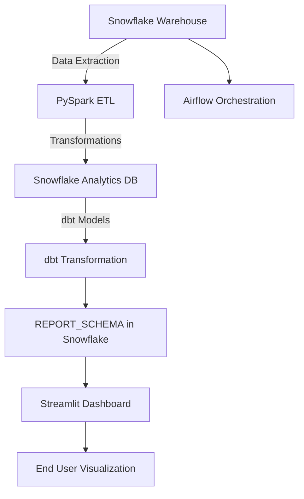

# Snowflake Data Engineering Pipeline with PySpark, Airflow, dbt, and Streamlit

  
  
  
  
  

## Project Overview

This project is a **modern data engineering pipeline** that integrates **PySpark**, **Snowflake**, **Airflow**, **dbt**, and **Streamlit** to manage the end-to-end process of data extraction, transformation, loading (ETL), and visualization.

The pipeline extracts large datasets from Snowflake, processes them using PySpark, applies transformation and analytics using dbt, and visualizes the results with Streamlit. Airflow orchestrates the entire workflow to ensure seamless automation and scheduling.

## Table of Contents

- [Features](#features)
- [Architecture](#architecture)
- [Tech Stack](#tech-stack)
- [Installation](#installation)
- [Pipeline Workflow](#pipeline-workflow)
- [Usage](#usage)
- [Streamlit Visualization](#streamlit-visualization)
- [License](#license)

## Features

- **PySpark-based ETL**: Efficiently handle large datasets for transformation and processing.
- **Snowflake as the Data Warehouse**: Centralized storage of raw and processed data.
- **Airflow Orchestration**: Automates and schedules ETL tasks.
- **dbt for Data Transformation**: Simplifies analytics and transformation of data in Snowflake.
- **Streamlit for Visualization**: Interactive and real-time dashboards for exploring insights.
- **Scalable and Modular**: Easily extendable to accommodate additional data sources, transformations, and visualizations.

## Architecture

## Tech Stack

- **PySpark**: For large-scale data extraction and transformation, leveraging distributed computing to process millions of records efficiently.
- **Snowflake**: As the central data warehouse for storing raw, transformed, and analytics data.
- **Airflow**: To orchestrate and automate the entire ETL workflow, ensuring tasks are scheduled and dependencies are handled seamlessly.
- **dbt (Data Build Tool)**: To manage SQL-based data transformations and create analytics models in a modular way using version-controlled code.
- **Streamlit**: For interactive web-based visualization, allowing users to explore and analyze the data in real time through a simple and intuitive interface.
